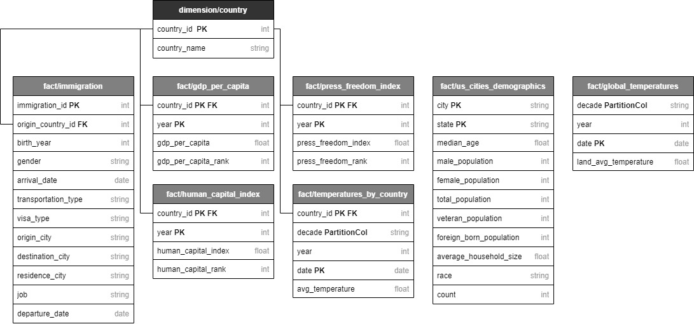
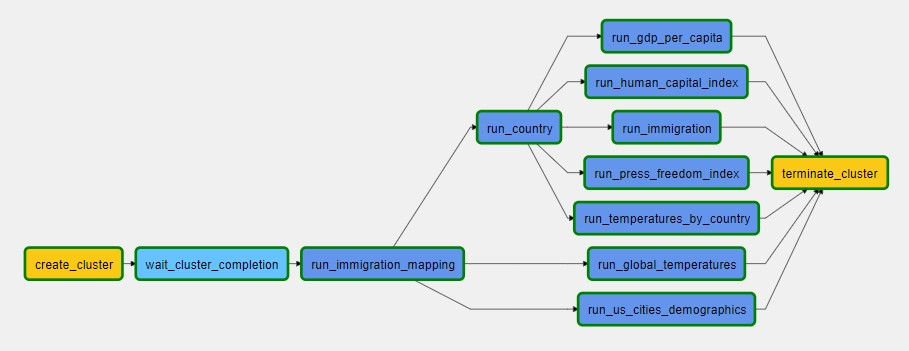
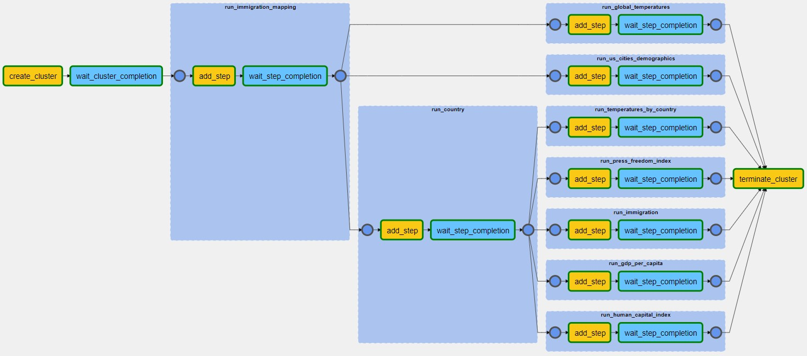

# Udacity Data Engineering Capstone Project

The purpose of the project is to combine what we've learned throughout the program.

**Contents**

- [Description](#Description)
- [Datasets](#Datasets)
- [Database Schema Design](#Database-Schema-Design)
- [ETL Notes](#ETL-Notes)
- [ETL Pipeline](#ETL-Pipeline)
- [How to Run](#How-to-Run)
- [Addressing Other Scenarios](#Addressing-Other-Scenarios)
- [Analysis](#Analysis)

## Description

Udacity provides four datasets for the project and also gives the student an option to use
additional data. Four datasets include immigration to US, US city demographics, temperature data
and airport codes. I won't use airport codes in my analysis, thus I leave it out of the project.
Instead, I will use some country based statistics to support my analysis.

### Technology Overview

- **Storage:** Amazon S3
- **Running environment:** Amazon EMR
- **Pipeline:** Apache Airflow
- **Container:** Docker
- **Automatic Deployment:** DeployHQ
- **Packages:** pyspark, omegaconf

I choose Amazon S3 - Amazon EMR combination instead of Amazon Redshift mainly because of these
terms:

- Cost: The project doesn't require a cluster to be open 24x7 like Redshift's.
- Data lake: Don't want to work on a traditional data warehouse structure, highly structured joins
  or staging steps.
- Ability to work with different unstructured data formats and potential for big data analytics are
  the other reasons of my choice.

## Datasets

**immigration:** Data includes immigrations to US in 2016. Contains international visitor arrival
statistics by world regions and countries, type of visa, mode of transportation, age groups, states
visited (first intended address only), and the top ports of entry (for select countries).

- source:
  [National Travel and Tourism Office](https://travel.trade.gov/research/reports/i94/historical/2016.html)

| column_name | description            | data_type |
|-------------|------------------------|-----------|
| cicid       | migrant_id             | int       |
| i94yr       | year                   | int       |
| i94mon      | month                  | int       |
| i94cit      | code of origin city    | int       |
| i94res      | code of origin country | int       |
| i94port     | code of departure city | string    |
| arrdate     | arrival date           | int       |
| depdate     | departure date         | int       |
| i94mode     | travel code            | int       |
| i94addr     | residence city         | string    |
| i94visa     | visa type              | int       |
| occup       | job                    | string    |
| biryear     | birth year             | int       |
| gender      | gender                 | string    |

**us_cities_demographics:** This dataset contains information about the demographics of all US
cities and census-designated places with a population greater or equal to 65,000. Data comes from
the US Census Bureau's 2015 American Community Survey.

- source:
  [Open Data Soft](https://public.opendatasoft.com/explore/dataset/us-cities-demographics/export/)

| column_name            | description             | data_type |
|------------------------|-------------------------|-----------|
| City                   | city name               | string    |
| State                  | state name              | string    |
| Median Age             | median age              | int       |
| Male Population        | male population         | int       |
| Female Population      | male population         | int       |
| Total Population       | total population        | int       |
| Number of Veterans     | population              | int       |
| Foreign-born           | foreign-born population | int       |
| Average Household Size | average household size  | float     |
| Race                   | race                    | string    |
| Count                  | count                   | int       |

**global_temperatures:** The Berkeley Earth Surface Temperature Study combines 1.6 billion
temperature reports from 16 pre-existing archives. Starts in 1750 for average land temperature,
1850 for max and min lan temperatures and global ocean land temperatures.

- source:
  [Kaggle](https://www.kaggle.com/berkeleyearth/climate-change-earth-surface-temperature-data)

| column_name                               | description                               | data_type |
|-------------------------------------------|-------------------------------------------|-----------|
| dt                                        | Date                                      | date      |
| LandAverageTemperature                    | global average land temperature           | float     |
| LandAverageTemperatureUncertainty         | the 95% confidence interval               | float     |
| LandMaxTemperature                        | global average maximum land temperature   | float     |
| LandMaxTemperatureUncertainty             | the 95% confidence interval               | float     |
| LandMinTemperature                        | global average minimum land temperature   | float     |
| LandMinTemperatureUncertainty             | the 95% confidence interval               | float     |
| LandAndOceanAverageTemperature            | global average land and ocean temperature | float     |
| LandAndOceanAverageTemperatureUncertainty | the 95% confidence interval               | float     |

**temperatures_by_country:** From same source with global temperatures, this dataset includes
temperature statistics by country.

- source:
  [Kaggle](https://www.kaggle.com/berkeleyearth/climate-change-earth-surface-temperature-data)

| column_name                       | description                     | data_type |
|-----------------------------------|---------------------------------|-----------|
| dt                                | Date                            | date      |
| Country                           | Country name                    | string    |
| LandAverageTemperature            | global average land temperature | float     |
| LandAverageTemperatureUncertainty | the 95% confidence interval     | float     |

**gdp_per_capita:** GDP per capita is a country's economic output divided by its population. It's a
good representation of a country's standard of living. It also describes how much citizens benefit
from their country's economy.

- source: [The World Bank](https://data.worldbank.org/indicator/NY.GDP.PCAP.CD)

| column_name     | description            | data_type |
|-----------------|------------------------|-----------|
| Country Name    | Country name           | string    |
| Year[1960-2020] | Gdp per capita of year | float     |

**human_capital_index:** Human capital is a central driver of sustainable growth and poverty
reduction according to World Bank. It simply shows how much a country values its people.

- source: [The World Bank](https://data.worldbank.org/indicator/HD.HCI.OVRL)

| column_name     | description                 | data_type |
|-----------------|-----------------------------|-----------|
| Country Name    | Country name                | string    |
| Year[2010-2020] | Human capital index of year | float     |

**press_freedom_index:** The data is collected through an online questionnaire sent to journalists,
media lawyers, researchers and other media specialists selected by Reporters without Borders (RSF)
in the 180 countries covered by the Index. It gives an idea about the freedom and tension level in
a country.

- source: [The World Bank](https://tcdata360.worldbank.org/indicators/h3f86901f)

| column_name     | description                 | data_type |
|-----------------|-----------------------------|-----------|
| Country Name    | Country name                | string    |
| Year[2001-2019] | Press freedom index of year | float     |

## Database Schema Design

Datasets are from different sources and have no common attribute except `country`. Therefore, id
generation process will be done for `country` column only. Since there are no other common info,
other id/code columns will be converted into full descriptions during data-transfer in order to
improve the efficiency in analytics at pyspark environment.

## ETL Notes

#### Use of omegaconf and yaml config files

I used yaml files for config instead of json due to interpolation capability of omegaconf. Thanks
to this capability, I am able to manage the source of truth of config from just one place.

#### Read and write with meta

All columns are casted during read and write methods. It is really important mainly because of two
reason:

- Unexpected data can be detected while reading
- It prevents schema related bugs in analytics
- Instead of requesting path, schema and data_format separately, only meta that includes all needed
  information is requested for cleaner code.

#### Country id generation

Country dimension table is created by other tables that include country columns. Since the data
sources are not same, the country names are also not totally identical. To eliminate those
differences, all those tables were analysed, and a
[similarity map](scripts/country_correction.yaml) is created. Country column of each table is
corrected with this map.

#### Input controls

Two datasets required input controls.

- [Temperatures by country](scripts/temperatures_by_country.py): Rows with null average temperature
  values are eliminated. Duplicated row are also removed.
- [Immigration](scripts/immigration.py): Immigration dataset belongs to year 2016. However, data
  includes rows from other years. Rows with years other than 2016 are removed.

Also `read_with_meta()` method provides a data validation to all scripts.

#### Use of partition columns

Partition columns are determined according to analytic queries. Temperature analysis
requires `decade` information. So `decade` column is created and temperature datasets are
partitioned by `decade`.

Other queries are not constantly demanding a partitioned info based on a single column, therefore
they're not partitioned by any column.

## ETL Pipeline

Apache Airflow is used to organize data-transfer pipeline.

- Create EMR cluster
- Run [immigration mapping](scripts/immigration_mapping.py) to get country names
- Run [country](scripts/country.py) and generate country ids
- Run remaining data-transfer scripts with join country dimension table
- Terminate cluster

With Airflow 2.0, `TaskGroup` is introduced to replace `SubDagOperator`. It is useful for creating
repeating patterns and cutting down visual clutter in a more efficient way
([for details](https://airflow.apache.org/docs/apache-airflow/stable/concepts.html#taskgroup)). I
used `TaskGroup` to group `EmrAddStepsOperator` and `EmrStepSensor` as below.

## How to Run

1. Pull the github repo.
1. Set `file_schema` and `bucket_name` in both [airflow](airflow/dags/config.yaml) and
   [script](scripts/config.yaml) configs.
1. Deploy [scripts/](scripts/) and [data/](data/) to your bucket.
    - I used DeployHQ to automatically deploy my codes from repo to Amazon S3.
1. Run `docker-compose up` in [airflow/](airflow/) directory.
1. Install requirements in airflow containers:
    - `docker exec -it <CONTAINER ID> pip3 install -r requirements.txt`
1. Open [http://localhost:8080/](http://localhost:8080/) and login with 'airflow' as both username
   and password.
1. Add `aws` connection with aws credentials.
1. Add empty `emr_default` connection.
1. Trigger DAG.

## Addressing Other Scenarios

1. **The data was increased by 100x:** Thanks to the vertically
   scaling, [instance types](https://aws.amazon.com/tr/ec2/instance-types/) can be upgraded or node
   counts can be increased easily to address this problem.
1. **The pipelines would be run on a daily basis by 7 am every day:** Instead of full historical
   datasets, daily datasets are loaded from source every day and updated or inserted to current
   data in S3. Also datasets can be partitioned by day for easy upsert processes. Besides, the id
   values shouldn't be changed on a daily basis. Thus, in this case, when a new county name has
   arrived, a new id is generated for just the new country name. Current ids won't be changed.
1. **The database needed to be accessed by 100+ people:** Amazon S3 supports 1,000 access points
   according
   to [S3 restrictions](https://docs.aws.amazon.com/AmazonS3/latest/userguide/access-points-restrictions-limitations.html)
   . So, it wouldn't be any problem.

## Analysis

Queries below are analyzed in Notebook. You may see the notebook directly for mor detail.

**Immigration summary**

- Top 10 origin_country that visits US in 2016
- Top 10 origin_country in terms of how long days spend in a visit
- Types of immigrations to US in 2016
- Top 10 city in terms of residence address of immigrations

**Visa type analysis**

- Top 10 origin country in terms of visiting US for education purpose
- Top 10 origin country in terms of visiting US for business purpose

**US cities demographics analysis**

- Top 10 cities with highest foreign-born people density
- Top 10 cities with highest veteran people density
- Top 10 states with youngest population

**Climate change analysis**

- Temperature changes since the beginning of 20th century
- Coldest countries by decade
- Greenland analysis
